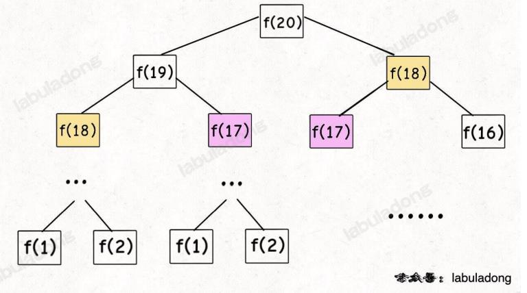
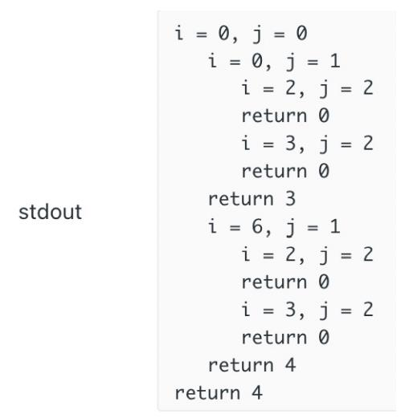

# 动态规划

斐波那契数列的数学形式就是递归的
```
func fib(int N) {
    if N == 1 || N == 2 {
        return 1
    }
    return fib(N-1)+fib(N-2)
}
```
从下面的递归树中可以看出，上述代码其实是暴力递归，它是非常低效的，**因为其中包含了大量的重复计算**，而对于重复计算我们可以使用备忘录的方式来避免重复计算


递归算法的时间复杂度如何计算呢？**就是用子问题个数 ✖ 解决一个子问题所需要的时间**

我们称图中的这种方式为**自顶向下**的方式，从一个规模较大的问题`f(20)`向下逐渐分解规模，直到`f(1),f(2)`这两个base case，然后逐层返回答案

反过来，如果我们直接从最底下、最简单、问题规模最小、已知结果的`f(1),f(2)`（base case）开始往上推，直到拿到我们想要的答案，这就是递归的思路，这也是**动态规划一般都脱离了递归，而是由循环迭代完成计算的原因**

## dp数组的遍历方向

无论是什么样的顺序，我们需要把握住两点：
- 遍历的过程中，所有状态必须是已经计算出来的
- 遍历结束后，存储结果的位置必须已经被计算出来


## 递归算法的调试
```
int dp(string& ring, int i, string& key, int j) {
    /* base case */
    if (j == key.size()) {
        return 0;
    }
    /* 状态转移 */
    int res = INT_MAX;
    for (int k : charToIndex[key[j]]) {
        res = min(res, dp(ring, j, key, i + 1));
    }
    return res;
}
```
如何对递归函数进行debug呢，labuladong中给出了一个很好的方法：通过缩进体现出递归的层次

```
int count = 0;
void printIndent(int n) {
    for (int i=0; i<n; i++) {
        printf("    ");
    }
}

/**
    就是在函数开头和所有return语句对应的地方加上一些代码
*/
int dp(string& ring, int i, string& key, int j) {
    printIndent(count++);
    printf("i=%d, j=%d", i, j);

    /* base case */
    if (j == key.size()) {
        printIndent(--count);
        printf("return 0\n");

        return 0;
    }
    /* 状态转移 */
    int res = INT_MAX;
    for (int k : charToIndex[key[j]]) {
        res = min(res, dp(ring, j, key, i + 1));
    }

    printIndent(--count);
    printf("return %d\n", res);

    return res;
}
```
