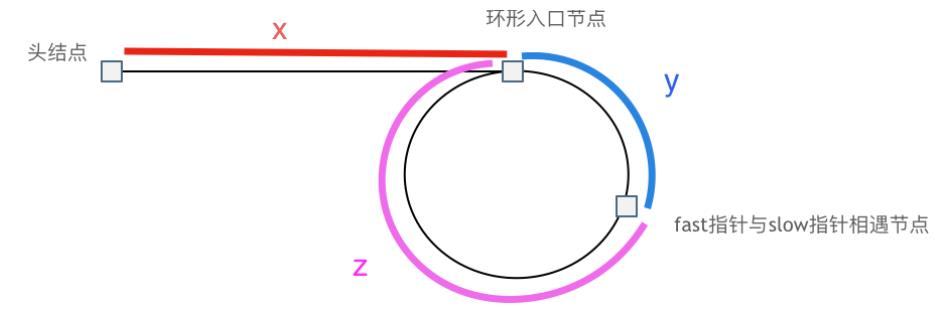

## 链表题目总结

1. 虚拟头节点：使用虚拟头节点，能够统一头节点和其他节点的处理方式，不需要单独去处理头节点，比如

   - leetcode 203 simple [移除链表元素]https://leetcode.cn/problems/remove-linked-list-elements/() 

2. 链表的基本操作包括：
   
   - 获取链表第index个节点的值
   - 在链表的最前面插入一个节点
   - 在链表的最后插入一个节点
   - 在链表第index个节点之前插入一个节点
   - 删除链表的第index个节点

    上述操作均能够体现在leetcode 707 middle [设计链表](https://leetcode.cn/problems/design-linked-list/)这道题目中，这里需要注意的是使用双链表更易实现

3. 反转链表：一般对于类似的链表题目都有两种解决方法：递归法和迭代法(双指针)，例题如下：

   - leetcode 206 simple [反转链表](https://leetcode.cn/problems/reverse-linked-list/)
   - leetcode 24 middle [两两交换链表中的节点](https://leetcode.cn/problems/swap-nodes-in-pairs/)
   - leetcode 160 simple [链表相交](https://leetcode.cn/problems/intersection-of-two-linked-lists-lcci/)，我走过你走的路，我们总会相遇🌈~
   - 这种情况下还有其他例题，待补充...

4. 快慢指针：也属于双指针，例题如下：
   
   - leetcode 19 middle [删除链表的倒数第N个节点](https://leetcode.cn/problems/remove-nth-node-from-end-of-list/)，思路是快指针先走N步，此时快慢指针都是行动，当快指针为`nil`是，慢指针刚好会指向要删除的第N个节点，因此如果加上dummy节点，慢指针酒水只想要删除的节点的前一个节点
   - leetcode 141 simple [环形链表](https://leetcode.cn/problems/linked-list-cycle/)，思路是快指针每次走两步，慢指针每次走一步，快慢指针一定会相遇在环里的某个位置，因为快指针一定是先进入环的，一旦慢指针也进入了环，那么相对于慢指针来说，快指针相当于一个节点一个节点的来追赶慢指针的
   - leetcode 142 middle [环形链表II](https://leetcode.cn/problems/linked-list-cycle-ii/)，思路是先通过快慢指针找到交点记作index1（快指针每次走2，慢指针每次走1），然后将index2从头开始，和index1同时移动，每次都只移动一个节点，index1和index2相交的位置就是环的入口，示意图如下：
    
    最开始相遇时，慢指针走的距离是`x+y`，快指针走的距离是`x+y+n(y+z)`，n为fast指针在环内走了n圈才遇到slow指针，（y+z）为 一圈内节点的个数（环的长度）
    因为fast是一次走两个节点，slow是一次走一个节点，因此`x+y+n(y+z)=2(x+y)`，即`x+y=n(y+z)`
    想要得到环的入口，即x的大小，`x=n(y+z)-y ---> x=(n-1)(y+z)+z`，这里n一定是大于等于1的，因为fast指针至少要多走一圈才能相遇slow指针
    取一个特殊情况，`n=1`的时候，即`x=z`
    这就意味着，从**头结点出发一个指针，从相遇节点也触发一个指针，这两个指针每次只移动一个位置，那么当这两个指针相遇时一定是在环的入口处**

