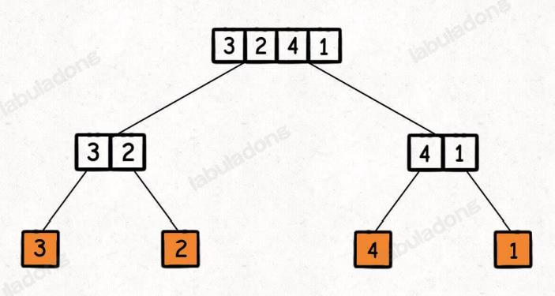

排序算法的稳定性：两个相等的元素，排序之后，其相对位置不会发生变化，则称排序算法是稳定的，反之为不稳定的

### 冒泡排序
```java
// 升序排列
for (int i = 0; i < nums.length; i++) {
    for (int j = 0; j < nums.length - i - 1; j++) {
        if (nums[j] > nums[j+1]) {
            swap(nums, i, j)
        }
    }
}
```
冒泡排序的时间复杂度为$O(n^2)$，是**稳定排序**，当数据完全有序时，时间复杂度为$O(n)$，但是这是没意义的，数组都完全有序了，还排序干啥😂

### 选择排序
算法思想：从未排序的数组中找到最小/最大的元素，存放到需要数组头部（数组有范围）
```java
// 升序排列
for (int i = 0; i < nums.length; i++) {
    min = i;
    // 找到最小值，记录下索引
    for (int j = i+1; j < nums.length; j++) {
        if (nums[min] > nums[j]) {
            min = j;
        }
    }
    if (i != min) {
        swap(nums, i, min);
    }
}
```
选择排序的时间复杂度为$O(n^2)$，是**不稳定排序**，比如[5，8，5，2，9]这一组数据，第一个5会被2换到第二个5的后面

但是选择排序在时间复杂度的角度来说是最稳定的，无论是什么数据进去都是$O(n^2)$

### 插入排序
算法思想：将数据插入到已经排序好的数组中
```java
// 升序排列
for (int i = 1; i < nums.length; i++) {
    // 将nums[i]插入到[0...i-1]中，[0...i-1]这段范围是有序的
    int curVal = nums[i];
    position = i-1;
    while (position >= 0 && nums[position] > curVal) {
        nums[position+1] = nums[position];
        position--;
    }
    nums[position+1] = curVal;
}
```
插入排序的时间复杂度是$O(n^2)$，是**稳定排序**

### 归并排序
核心思想是先使子序列有序，然后合并子序列，得到完全有序的序列，一般使用2-路归并，即将两个有序序列合并成一个有序序列
```java
// 升序排列
void sort(int[] nums, int left, int right) {
    int mid = left + (right-left) / 2;
    sort(nums, left, mid);
    sort(nums, mid+1, right);
    // 合并两个有序数组
    merge(nums, left, mid, right);
}
// 可以看出来，归并排序的递归写法很向 树的后序遍历
```
归并排序的时间复杂度为$O(nlogn)$，代价是需要额外的空间，以空间换时间
> 这个时间复杂度的分析过程我们可以将归并排序的过程想象成一棵二叉树，如下图所示，树的高度为$log n$，每一层的节点个数为$n$，因此时间复杂度是$n log n$，归并排序是**稳定**的




归并排序的使用很广泛，比如
> leetcode 315 [计算右侧小于当前元素的个数](https://leetcode.cn/problems/count-of-smaller-numbers-after-self/description/)
- [Go代码](merge/application/count_smaller.go)
- [Java代码](merge/application/CountSmaller.java)


### 快速排序
核心思想是 选择出一个数（pivot）作为基准，比这个数小的放在pivot的左边，比这个数大的放在pivot的右边，递归前面的过程

核心代码
```go
func sort(nums []int, left, right int) {
    if left < right {
        pivot := partition(nums, left, right)
        sort(nums, left, pivot-1)
        sort(nums, pivot+1, right)
    }
}
// 重点在于partition函数中，在该函数中，我们需要返回一个索引，该索引前的数字都比他小，后的数字都比他大
func partition(nums int[], left, right int) {
    rand.Seed(time.Now().UnixMicro())
    // rand.Intn(n)生成的是一个[0,n)的随机数，打乱一下顺序，或者是直接shuffle整个数组
	idx := left + rand.Intn(right-left+1)
    swap(nums, left, idx)
    pivot := nums[left]

    leftIdx, rightIdx := left+1, right
    for leftIdx <= rightIdx {
        for leftIdx <= right && nums[leftIdx] < pivot {
            leftIdx++
        }
        for rightIdx >= left && nums[rightIdx] >= pivot {
            rightIdx--
        }

        if leftIdx >= rightIdx {
            break
        }

        swap(nums, leftIdx, rightIdx)
    }
    swap(nums, left, rightIdx)
}
```

这里值得注意的是我们需要在每次partition之前打乱一下数组的顺序，这是为了避免极端情况的出现，快排会退化成选择排序。
比如数组`654321`，我们的`pivot=6`，所有的数组都会移动一下...

**labuladong的看法（很巧妙）：快速排序的过程是一个构造二叉搜索树的过程**

> https://mp.weixin.qq.com/s/8ZTMhvHJK_He48PpSt_AmQ

快排的平均时间复杂度为$O(nlogn)$，最坏时间复杂度为$O(n^2)$，**不稳定排序**，比如`{2, 1, 1, 3} `，我们以2为基准，在partition的过程中会将两个1的位置对换


二分搜索问题需要按照开闭区间去想

1. `sortWithoutRepeatElement` 在没有重复元素的升序数组中查找元素，如果没有，返回-1，leetcode 704 simple
2. `findInsertPlace` 在没有重复元素的升序数组中查找元素，如果没有，返回应该插入的位置，leetcode 35 simple

    相同的一道题目 leetcode 69 simple 寻找x的平方根，思路和查找插入位置是一样的！
3. `sortWithRepeatElement` 在存在重复元素的升序数组中查找元素的左右边界，leetcode 34 middle


> 参考链接：https://zhuanlan.zhihu.com/p/42586566#:~:text=%E4%B8%8B%E9%9D%A2%E4%BB%8B%E7%BB%8D%E5%87%A0%E7%A7%8D%E5%B8%B8%E8%A7%81,%E7%94%A8Java%E5%AE%9E%E7%8E%B0%E3%80%82