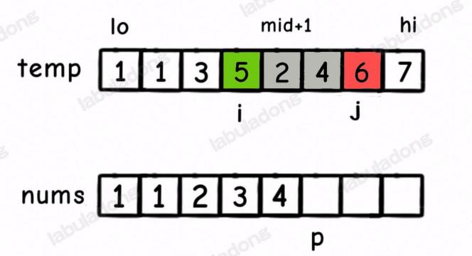

## 归并排序的应用

**基本上都是修改merge函数**

[剑指 Offer 51. 数组中的逆序对](https://leetcode.cn/problems/shu-zu-zhong-de-ni-xu-dui-lcof/)
这里需要注意的一个点是在merge函数中统计个数的代码为
```go
if tmp[i] > tmp[j] {
    count += mid+1-i
}
```
表示的是`[i, mid]`这个区间内比`tmp[j]`大还有`mid-i+1`个
- [Go实现](./reverse_pairs.go)
- [Java实现](./ReversePairs.java)

[leetcode 493 翻转对](https://leetcode.cn/problems/reverse-pairs/description/)
```go
// 实现方式就是在 剑指 Offer 51. 数组中的逆序对 的基础上加上一段逻辑（merge方法中）
merge = func(nums []int, left, mid, right int) {
    end := mid+1
    for k := left; k <= right; k++ {
        tmp[k] = nums[k]
    }

    // 在这里先判断一下，有多少符合条件的
    // 这样写的原因是以 右边的部分为基准
    for i := left; i <= mid; i++ {
        for end <= right && tmp[i] > 2*tmp[end] {
            end++
        }
        count += end-(mid+1)
    }

    i, j := left, mid+1
    for p := left; p <= right; p++ {
        if i == mid+1 {
            nums[p] = tmp[j]
            j++
        } else if j == right+1 {
            nums[p] = tmp[i]
            i++
        } else if tmp[i] > tmp[j] {
            nums[p] = tmp[j]
            // 这里有一个疑问，为什么不能够是这样的代码
            // 是因为这样写会漏掉，比如
            // 1,4,9  1,3
            // 当j指向3的时候，i指向的9不会把它算进去，会跳过去
            // if tmp[i] > 2*tmp[j] {
            //     count += mid+1-i
            // }
            j++
        } else {
            nums[p] = tmp[i]
            i++
        }
    }
}
```

[leetcode 315. 计算右侧小于当前元素的个数](https://leetcode.cn/problems/count-of-smaller-numbers-after-self/description/)

这里需要注意的点是merge函数中统计个数的代码为
```go
// 根据上图可以看出，只要是nums[p] = tmp[i]的时候，就需要统计个数，个数为[mid+1, j)区间内的所有元素个数
if j == right+1 {
    count[pairs[p].idx] += j-mid-1
}

if tmp[i].val < tmp[j].val {
    count[pairs[p].idx] += j-mid-1
}
```
- [Go实现](count_smaller.go)
- [Java实现](CountSmaller.java)

[leetcode 327 区间和的个数](https://leetcode.cn/problems/count-of-range-sum/description/)

这里需要注意的一个点是，按照我最开始的想法，是先求得数组的前缀和，然后再去挨个的判断是否在区间内，这种算法的时间复杂度为$O(n^2)$，在leetcode中提交超时

**这道题目的难点在于相到对前缀和数组进行归并排序，在merge的过程中统计符合条件的区间和**

这道题的merge实现思路和`leetcode 315. 计算右侧小于当前元素的个数`是相似的，不是使用双重循环来统计符合条件的结果，而是使用两个变量来控制边界
```java
for (int i = left; i <= mid; i++) {
    int start = mid+1, end = mid+1;
    while (start <= right && tmp[start] - tmp[i] < lower) {
        start++;
    }

    while (end <= right && tmp[end] - tmp[i] <= upper) {
        end++;
    } 
    count += end - start;
}
```
- [Go实现](./count_range_sum.go)
- [Java实现](./CountRangeSum.java)