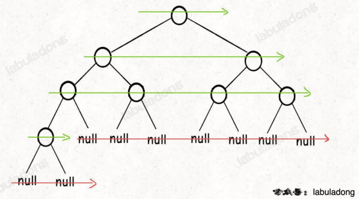

### 二叉树遍历

事实上二叉树中最重要的就是二叉树的遍历，大多数的题目都是在遍历的基础上展开的，遍历总体上分为两个方向：深度优先遍历和广度优先遍历，深度优先遍历的迭代写法使用栈，又分为了前序(根左右)、中序(左根右)和后序(左右根)，广度优先遍历需要使用队列，其实就是层序遍历。

**能够使用递归实现的一定能够用栈迭代实现**

> 二叉树的遍历还一种是Morris遍历，这种遍历方法的时间复杂度为$O(1)$

代码随想录中为实现后序遍历提供了一种新的思路：前序遍历的顺序是 `根左右`，后序遍历的顺序是`左右根`，所以后序遍历可以根据前序遍历的代码实现，顺序是`根左右` -> `根右左` -> `左右根`

```
var res []int
while !stack.isEmpty() {
    node := stack.Pop()
    res = append(res, node.val)
    if node.left != null {
        stack.Push(node.left)
    }
    if node.right != nil {
        stack.Push(node.Right)
    }
}

reverse(res)
```

- leetcode 144 simple [前序遍历](https://leetcode.cn/problems/binary-tree-preorder-traversal/)
- leetcode 94 simple [后序遍历](https://leetcode.cn/problems/binary-tree-inorder-traversal/)
- leetcode 145 simple [后序遍历](https://leetcode.cn/problems/binary-tree-postorder-traversal/)


二叉树的**层序遍历**本质上就是广度优先遍历，需要借助队列实现，这里迭代写法就不再赘述，递归写入如下：
```
func levelTraversalRecursive(root *TreeNode) [][]int {
	ans := [][]int{}
	depth := 0

	var order func(root *TreeNode, depth int)
	order = func(root *TreeNode, depth int) {
		if root == nil {
			return
		}
		if len(ans) == depth {
			ans = append(ans, []int{})
		}
		ans[depth] = append(ans[depth], root.Val)

		order(root.Left, depth+1)
		order(root.Right, depth+1)
	}

	order(root, depth)

	return ans
}
```

除了一些比较简单的层序遍历的题目之外，比如二叉树的右视图，每一层的最大值/最小值/平均值，N叉树的层序遍历之外，比较有意义的是leetcode 116和leetcode 117 middle [填充每个节点的下一个右侧节点](https://leetcode.cn/problems/populating-next-right-pointers-in-each-node-ii/submissions/)，同样这两道题无论是否要求是完美二叉树，都能够使用层序遍历很好的解决掉
```
// 收集其每一层的节点，在遍历下一层之前，进行处理
for i := 0; i < len(levelNodes) - 1; i++ {
    levelNodes[i].Next = levelNodes[i+1]
}
```
同样也能够使用递归解决，不同之处在于非完美二叉树当前节点的Next节点（右侧）不一定存在

除此之外，使用层序遍历还能够解决leetcode 104 simple [二叉树最大深度](https://leetcode.cn/problems/maximum-depth-of-binary-tree/)和 leetcode 111 simple [最小深度的问题](https://leetcode.cn/problems/minimum-depth-of-binary-tree/)，当然也能够使用递归实现，但值得注意的是：在递归实现最小深度时，需要注意左右节点不同时存在的场景，经典case：只有左/右子树

使用层序遍历判断[leetcode 958 是否为完全二叉树](https://leetcode.cn/problems/check-completeness-of-a-binary-tree/)


### 经典题目之对称二叉树

leetcode 101 [对称二叉树](https://leetcode.cn/problems/symmetric-tree/)，如下代码
```
class Solution {
    public boolean isSymmetric(TreeNode root) {
        if (root == null) {
            return true;
        }
        return process(root.left, root.right);
    }

    // p指向左树，q指向右树
    public boolean process(TreeNode p, TreeNode q) {
        if (p == null && q == null) {
            return true;
        }
        if (p != null && q != null && q.val == p.val) {
            return process(p.left, q.right) && process(p.right, q.left);
        } else {
            return false;
        }
    }
}
```

可以看到和其他题目不同的是，这个对称二叉树相当于比较两棵树，也能够使用迭代的方式来实现，延续层序遍历的想法，不同的是每次需要弹出两个节点，再按照顺序把他们的子节点加入到队列/栈中

和这道题目类似的还有leetcode 100 simple [相同的树](https://leetcode.cn/problems/same-tree/)以及 leetcode 572 simple [另一棵树的子树](https://leetcode.cn/problems/subtree-of-another-tree)

相同的树的代码和对称二叉树几乎一样，而另一棵树的子树这道题目需要这么考虑：是子树只有三种情况：两根树一样，子树位于左子树上，子树位于右子树上
```
return isSameTree(root, subTree)
```

### 二叉树节点个数
完全二叉树指的是除了最后一层可能不满，所有的层都是满的

因此，求节点个数可以在统计出左右子树节点个数的基础上加上对完全二叉树性质的利用

我们知道，满二叉树的节点个数是$2^n-1$，所以对于完全二叉树上的任意一部分都能够看作满二叉树来计算

### 平衡二叉树

```
		if leftHeight >= 0 && rightHeight >= 0 && (leftHeight-rightHeight <= 1 || leftHeight-rightHeight >= -1) {
			return max(leftHeight, rightHeight) + 1
		} else {
			return -1
		}
```
`if`的判断逻辑不能向上面这样写，因为如果`leftHeight==0, rightHeight==2`，他们两个的差也是小于1的，但是很明显不合题意

> 此外， 运算符的优先级是：括号 > 逻辑与(&&) > 逻辑或(||)

### 二叉搜索树

**性质**

1. 对于任意一个节点，其左子树的值必定小于该节点的值，右子树的值必定大于该节点的值
2. 中序遍历二叉搜索树的结果是升序排列的

二叉搜索树的题目通常就是利用这两个性质来解题的


### 题目列表

- leetcode 144 simple [二叉树的前序遍历](https://leetcode.cn/problems/binary-tree-preorder-traversal/) 
- leetcode 145 simple [二叉树的后序遍历](https://leetcode.cn/problems/binary-tree-postorder-traversal/)
- leetcode 94 simple [二叉树的中序遍历](https://leetcode.cn/problems/binary-tree-inorder-traversal/)
- 层序遍历
  - leetcode 102 middle [二叉树的层序遍历](https://leetcode.cn/problems/binary-tree-level-order-traversal/)
  - leetcode 107 middle [二叉树的层次遍历II](https://leetcode.cn/problems/binary-tree-level-order-traversal-ii/)
  - leetcode 199 middle [二叉树的右视图](https://leetcode.cn/problems/binary-tree-right-side-view/)
  - leetcode 637 simple [二叉树的层平均值](https://leetcode.cn/problems/average-of-levels-in-binary-tree/)
  - leetcode 429 middle [N叉树的层序遍历](https://leetcode.cn/problems/n-ary-tree-level-order-traversal/)
  - leetcode 515 middle [在每个树行中找最大值](https://leetcode.cn/problems/find-largest-value-in-each-tree-row/)
  - leetcode 116 middle [填充每个节点的下一个右侧节点指针](https://leetcode.cn/problems/populating-next-right-pointers-in-each-node/)
  - leetcode 117 middle [填充每个节点的下一个右侧节点指针II](https://leetcode.cn/problems/populating-next-right-pointers-in-each-node-ii/)
  - leetcode 104 simple [二叉树的最大深度](https://leetcode.cn/problems/maximum-depth-of-binary-tree/)
  - leetcode 111 simple [二叉树的最小深度](https://leetcode.cn/problems/minimum-depth-of-binary-tree/)
    
    > 深度问题使用层序遍历是通解，但是正常情况下使用递归解法做就好了
  
- leetcode 226 simple [翻转二叉树](https://leetcode.cn/problems/invert-binary-tree/description/)
- leetcode 101 simple [对称二叉树](https://leetcode.cn/problems/symmetric-tree/)
- leetcode 222 middle [完全二叉树的节点个数](https://leetcode.cn/problems/count-complete-tree-nodes/)
- leetcode 110 simple [平衡二叉树](https://leetcode.cn/problems/balanced-binary-tree/)
    
    > 这道题错了错了很多次了！！
    
- leetcode 257 simple [二叉树的所有路径](https://leetcode.cn/problems/binary-tree-paths/)    
- leetcode 404 simple [左叶子之和](https://leetcode.cn/problems/sum-of-left-leaves/)
- leetcode 513 middle [左下角的值](https://leetcode.cn/problems/find-bottom-left-tree-value/)
- leetcode 112 simple [路径总和](https://leetcode.cn/problems/path-sum/)
- leetcode 106 middle [中序和后序遍历构造二叉树](https://leetcode.cn/problems/construct-binary-tree-from-inorder-and-postorder-traversal/)
- leetcode 654 simple [最大二叉树](https://leetcode.cn/problems/maximum-binary-tree/)
- leetcode 617 simple [合并二叉树](https://leetcode.cn/problems/merge-two-binary-trees/)
- 二叉搜素树BST
  - leetcode 700 simple [二叉搜索树中的搜索](https://leetcode.cn/problems/search-in-a-binary-search-tree/)
  - leetcode 98 middle [验证二叉搜索树](https://leetcode.cn/problems/validate-binary-search-tree/)
  - leetcode 530 simple [二叉搜索树的最小绝对差](https://leetcode.cn/problems/minimum-absolute-difference-in-bst/)
  - leetcode 501 simple [二叉搜索树中的众数](https://leetcode.cn/problems/find-mode-in-binary-search-tree/)
  - leetcode 236 middle [二叉树的最近公共祖先](https://leetcode.cn/problems/find-mode-in-binary-search-tree/)
  - leetcode 235 middle [二叉搜索树的最近公共祖先](https://leetcode.cn/problems/lowest-common-ancestor-of-a-binary-search-tree/)
  - leetcode 701 middle [二叉搜索树中的插入操作](https://leetcode.cn/problems/insert-into-a-binary-search-tree/)
  - leetcode 450 middle [删除二叉搜索树中的节点](https://leetcode.cn/problems/delete-node-in-a-bst/)
  - leetcode 669 middle [修剪二叉搜索树](https://leetcode.cn/problems/trim-a-binary-search-tree/)
  - leetcode 108 simple [把有序数组转换成二叉搜索树](https://leetcode.cn/problems/trim-a-binary-search-tree/)
  - leetcode 538 simple [把二叉搜索树转换为累加树](https://leetcode.cn/problems/convert-bst-to-greater-tree/)